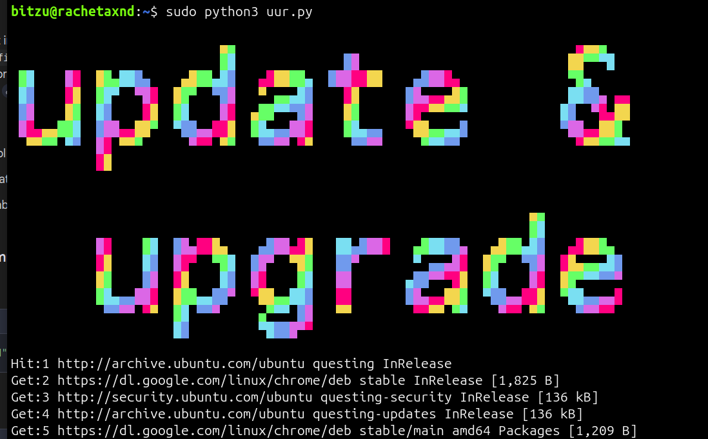

# update-upgrade-reboot
too lazy to write 3 commands? this py script will beautifully do it for you (for debian distros)
run with `sudo python3 uur.py`

****************************

****************************
